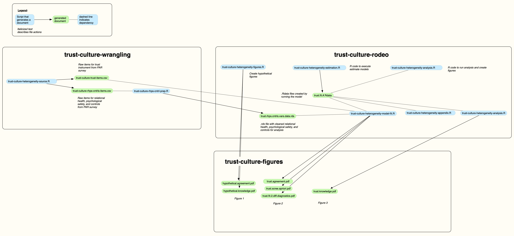

# trust-culture repository

## Overview

This is the repository for a paper.

## Folders

There are two folders:

  * The rodeo folder-this folder contains the cleaned data and the files to render the final report.
  
  * The wrangling folder-this contains the raw data and the scripts to prepare the data for analysis (that is, the rodeo folder).
  
## Workflow Map

The workflow map provides a visualization of the workflow:

