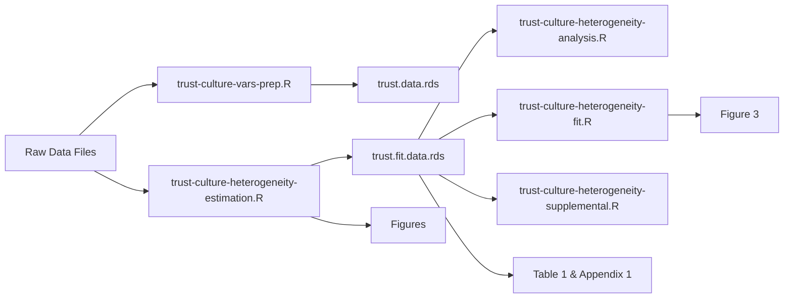

# **[What does culture “look like”?: Relationship models, heterogeneity, and the meaning of trust in a women’s prison]()**

 

## Author: [Jacob T.N. Young](https://jacobtnyoung.github.io/)

### ***Abstract***

“Culture” is frequently invoked as an explanatory device in criminology and criminal justice. Research examining the “culture” of women’s prisons emphasizes the salience of trust relationships for understanding social order. However, this work primarily documents the importance of trust, with less attention to understanding the meanings incarcerated women attribute to trust relationships. This manuscript presents two studies examining the cultural domain of trust in a women’s prison. Study 1 uses qualitative inquiry (n = 29) to identify key themes regarding the meaning of the domain. Building from these findings, Study 2 (n = 198) develops quantitative measures to examine a cultural model of trust. Results for Study 2 reveal two cultural models of trust (i.e. a multicentric cultural domain) and highlight how knowledge of the cultural model correlate with beliefs relevant to the setting (i.e. cultural consonance). Implications for the study of culture in criminology and criminal justice.

## Overview of Repository

### Folders

There are three folders:

  * *trust-culture-rodeo*-this folder contains the cleaned data and the files to render the analyses.
  
  * *trust-culture-wrangling*-this contains the raw data and the scripts to prepare the data for analysis (that is, the rodeo folder). Note that the raw data used in the analysis cannot be shared as they are restricted use.

Each folder contains a README file that describes the contents of the folder in more detail.
  
## Workflow Map

The workflow map provides a visualization of the workflow:

